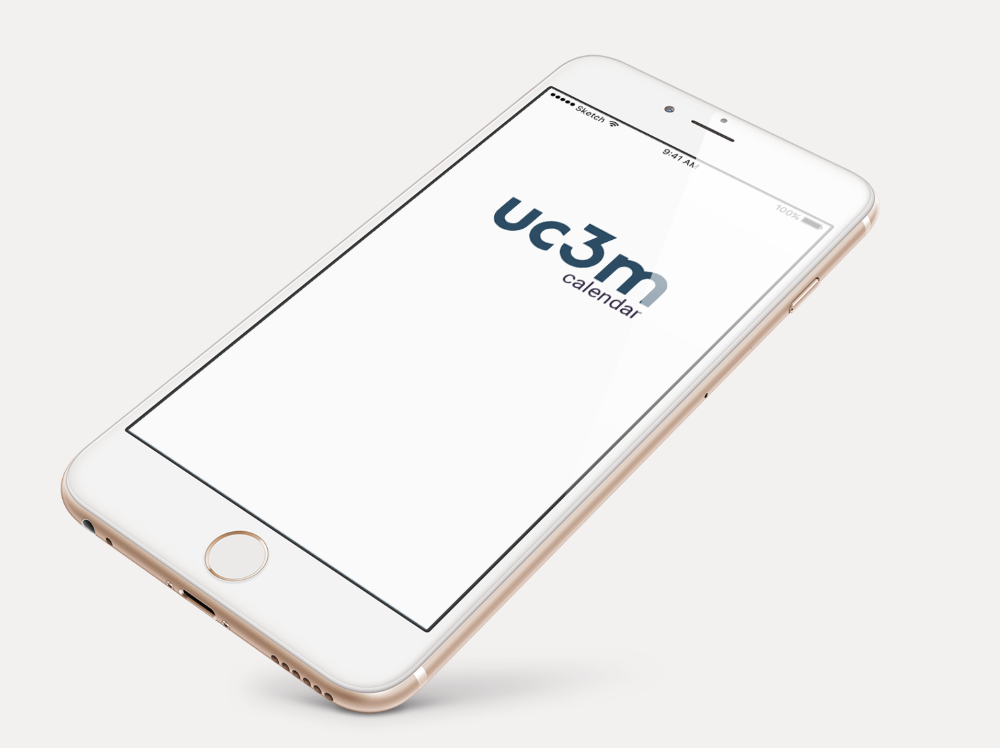
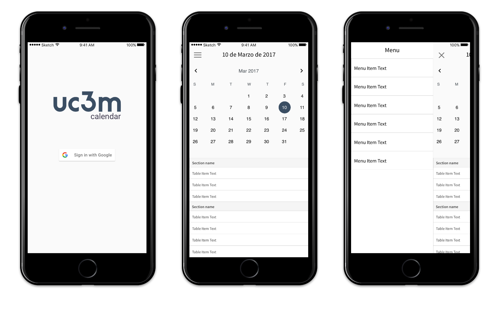

# UC3M Calendar
**Práctica final de la asignatura de Diseño de Sistemas Interactivos 2016/2017.**

### ¿Cuál es el contexto donde se desarrolla el proyecto? 

En el desarrollo de esta aplicación nos encontramos un contexto eminentemente académico. La idea es crear un flujo de información eficiente entre alumnos y profesores, con una interfaz-calendario personal con diversas funcionalidades que permitirá manejar los eventos de cada parte independientemente. Esta información será todo suceso relevante tanto para el profesor como para el alumno: eventos importantes o interesantes del campus, cambios en horarios, entregas de trabajos, aviso de notas o fechas de entrega… 

La herramienta será algo similar al calendario de Aula Global, específico para cada alumno/profesor, y estará indicada para alumnos y profesores que tengan gran actividad en el campus durante el curso académico. 

### Objetivos principales

¿Cuáles son los objetivos de este proyecto?

El objetivo del proyecto es crear un sistema con una interfaz eficiente basada en un calendario de eventos y notificaciones que apueste por la simpleza, pero manteniendo las buenas prácticas del principio de usabilidad: fácil de usar, fácil de recordar y aprender y sobre todo, que suponga una cierta satisfacción en los usuarios (comparando con la herramienta análoga Aula Global). 

Cada entidad tendrá una interfaz diferente ajustada a sus necesidades (y dispositivos); será más personal y eficiente a la hora de manejar eventos. El propósito final es que la aplicación sea utilizada (que no sea una mera herramienta como Aula Global, que en algunos aspectos tiene un uso nulo o no es realmente útil).

